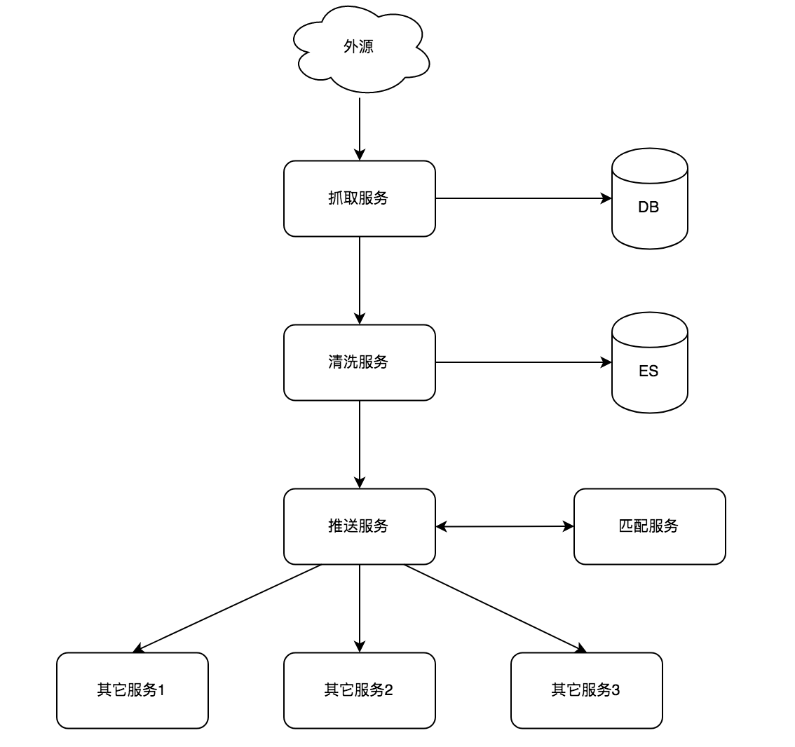

### 爬虫框架 & 爬虫系统

爬虫框架和爬虫系统有什么区别？其实就类似于Spring框架和借助Spring完成功能开发的Java工程两者之间的关系。

框架的目标在于解决某些特定的通用的**技术**问题，比如Spring框架解决了对象之间的依赖关系，Mybatis框架解决了数据库数据与domain对象的转换等。在做Java web开发中，每个Java系统都会面临这样的技术问题，于是有人就开发了解决这些问题的通用框架，利用这些框架能极大得提升开发效率。

系统的目标是解决业务问题。比如电商系统要解决用户浏览，加入购物车，下单等操作。它的核心点就是业务，技术在其次。

可以说，系统是建立在框架之上的，利用好技术框架就能更快解决技术问题，加速业务开发进度。

爬虫框架和爬虫系统的关系也是这样的，只不过不同于常规的业务系统和技术框架，爬虫系统也更偏向于技术，而不是业务。

### 爬虫系统的关键点

* 统一实体定义。每一个被抓取的数据称之为一个实体，比如一个豆瓣的图书，一个时光网的电影。我们通过实体来源，实体类型，实体唯一ID来精确描述一个被抓取的数据。统一实体定义是爬虫系统的基石，没有统一实体定义就无法建立一个面向任何类型数据的爬虫系统。
* 任务调度。一个成熟的爬虫系统断然不会只跑一个抓取任务，我们面临的问题是多爬虫任务同时在多台机器上运行，分布式任务调度系统是个必然选项。
* 数据存储。数据存储要解决两个问题，一个是要存什么数据，二是怎么存。目前我们会存储原始抓取数据和解析后数据。存储原始抓取数据目的是发现解析过程有问题时可以调试，当修复完解析逻辑后还能够进行重新清洗。存储解析后数据主要是保存抓取到的有价值的数据以备他用。怎么存？原始数据我们用了MySQL分区表，利用主键id分区，会定期删掉老数据。解析后数据存放在ElasticSearch中，便于查询检索。
* 匹配算法。当我们把数据抓取到并且解析成结构化数据存放在ES中后，整个流程并不是就终止了，我们还需要把这些外来数据补充到我们原有的数据中去。举个例子，我们抓取了豆瓣的《大话西游》电影条目，为了把豆瓣的数据补充到我们的库中，我们需要计算出我们库中已有的《大话西游》电影实际上和豆瓣的是一样的数据。我们利用匹配算法达成这一目标。

### 爬虫系统架构图

### 爬虫系统设计思路

我们把爬虫各个环节做了梳理之后，按照单一职责原则，划分出抓取服务，清洗服务，推送服务，匹配服务这四个服务。

* 抓取服务。负责抓取和简单解析数据，抓取任务通过分布式任务框架调度。
* 清洗服务。负责数据清洗和归一化，处理完成的数据会写入到ES中存储。
* 推送服务。负责接收清洗服务清洗完成的数据，并且根据不同业务方的需要进行对象转换，然后推送到业务方。
* 匹配服务。负责计算外源数据与已有数据的相似度，产出匹配关系

